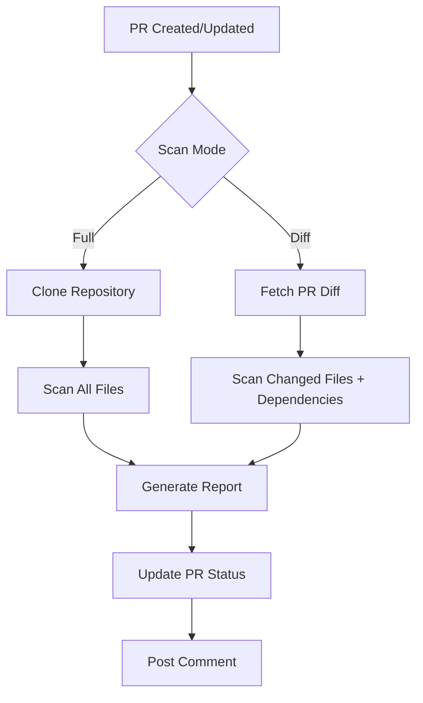
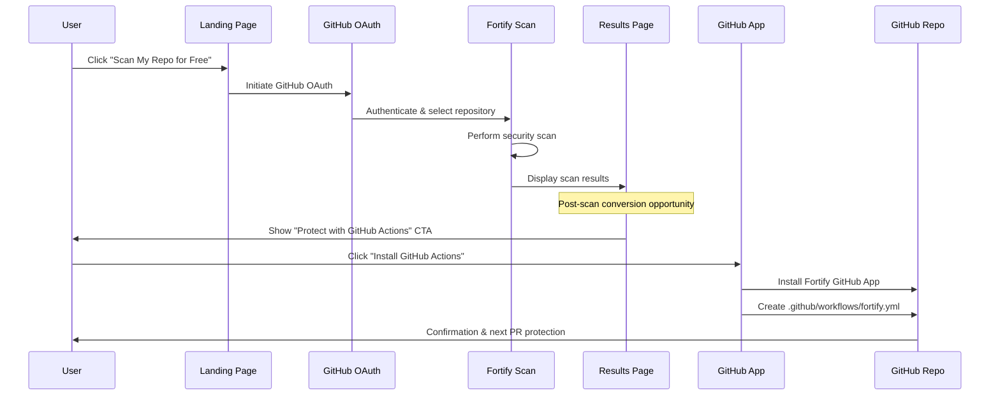
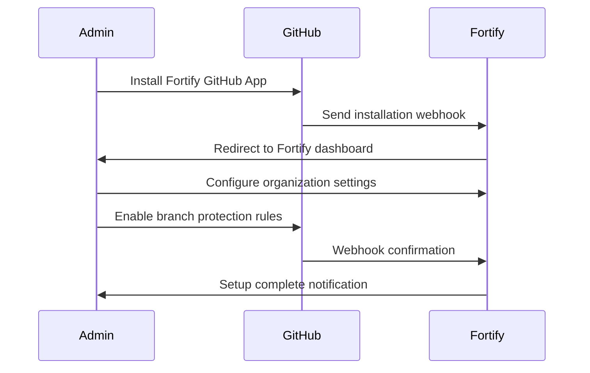
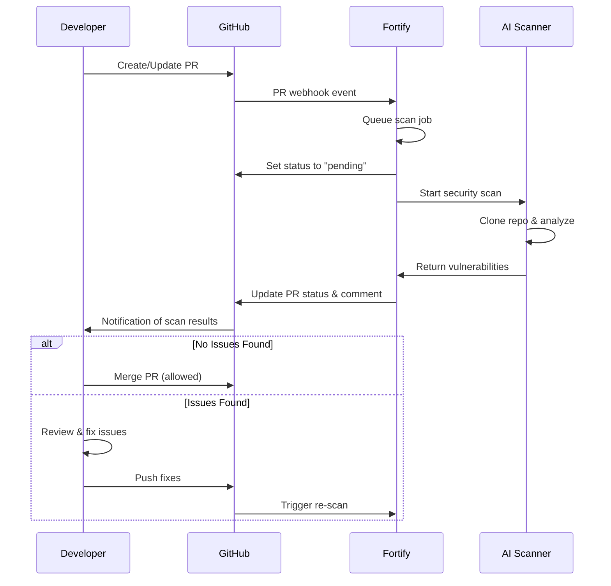
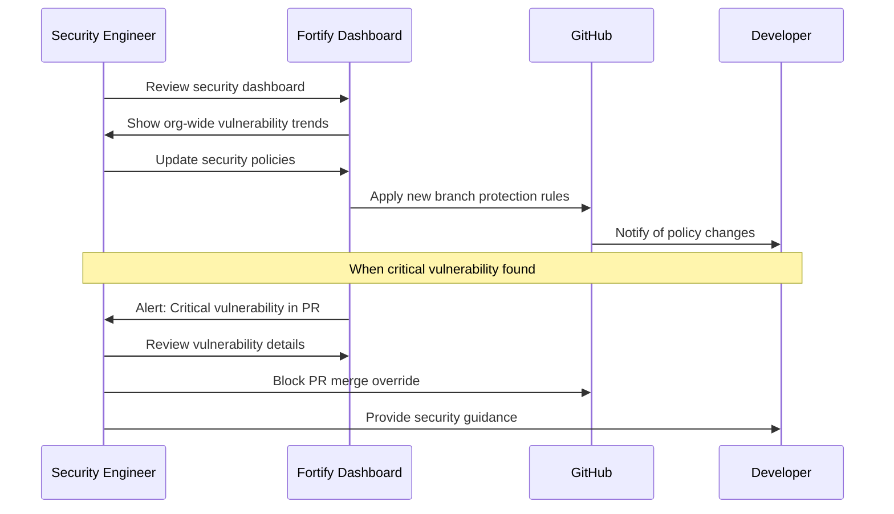
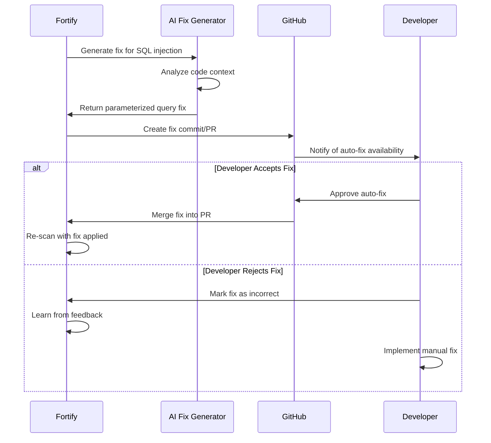
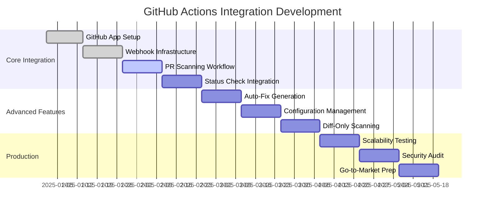

# GitHub Actions PR Security Integration PRD

> **Version:** v1.0  
> **Status:** Draft  
> **Target Release:** Q2 2025  
> **Team:** Fortify Security Platform  

---

## 1. Executive Summary

### Product Overview
The GitHub Actions PR Security Integration transforms Fortify into a mandatory security gate within the pull request workflow. This integration ensures that all code changes are automatically scanned for vulnerabilities before merge approval, preventing security issues from entering the main codebase.

### Key Value Proposition
- **Shift-Left Security**: Catch vulnerabilities at PR creation, not in production
- **Zero-Configuration Security**: Automatic scanning with intelligent defaults
- **Developer-Friendly**: Non-blocking workflow with actionable feedback
- **Compliance-Ready**: Audit trail for all security decisions and fixes

### Success Metrics
- **Primary**: 95% vulnerability prevention rate in protected repositories
- **Secondary**: <30 second scan completion for typical PR diffs
- **Adoption**: 80% of integrated repositories enable PR protection within 30 days

---

## 2. Problem Statement

### Current Pain Points
1. **Post-Merge Discovery**: Security vulnerabilities discovered after code is merged require expensive rollbacks
2. **Manual Security Reviews**: Security teams become bottlenecks in fast-moving development cycles
3. **Context Loss**: Security issues found days/weeks later lack the original context for efficient fixes
4. **Inconsistent Coverage**: Ad-hoc security scanning leads to gaps in coverage

### Market Opportunity
- **Developer Productivity**: Eliminate security-related PR rejections and rework cycles
- **Risk Reduction**: Prevent security debt accumulation in main branches
- **Compliance Automation**: Meet security requirements without manual overhead
- **Cost Savings**: Fix vulnerabilities 10x cheaper at PR stage vs. production

---

## 3. Target Users

### Primary Users

**Development Teams**
- **Size**: 5-50 developers per organization
- **Pain**: Security delays blocking feature delivery
- **Goal**: Maintain velocity while improving security posture
- **Success**: Seamless security integration that doesn't slow development

**Security Engineers**
- **Size**: 1-5 security professionals per organization  
- **Pain**: Cannot scale security reviews across all PRs
- **Goal**: Automated security enforcement with audit capabilities
- **Success**: Comprehensive security coverage with minimal manual intervention

### Secondary Users

**Engineering Managers**
- **Goal**: Balance development speed with security requirements
- **Success**: Predictable development cycles without security surprises

**Compliance Officers**
- **Goal**: Demonstrate security controls and audit trails
- **Success**: Automated documentation of security decisions

---

## 4. Product Requirements

### 4.1 Core Features

#### GitHub Actions Workflow Integration
```yaml
# .github/workflows/fortify-security.yml
name: Fortify Security Scan
on:
  pull_request:
    types: [opened, synchronize, reopened]
    
jobs:
  security-scan:
    runs-on: ubuntu-latest
    steps:
      - uses: actions/checkout@v4
        with:
          fetch-depth: 0  # Required for diff analysis
      - uses: fortify-security/pr-scan-action@v1
        with:
          api-token: ${{ secrets.FORTIFY_API_TOKEN }}
          scan-mode: 'full'  # 'full' or 'diff-only'
          block-merge: true
          severity-threshold: 'HIGH'
```

#### Automatic PR Status Checks
- **Status Check Integration**: Native GitHub status check that blocks merge when vulnerabilities found
- **Progressive Disclosure**: Summary status with expandable details
- **Status States**:
  - ✅ `fortify/security-scan` — No vulnerabilities found
  - ⚠️ `fortify/security-scan` — Low/Medium severity issues (non-blocking)
  - ❌ `fortify/security-scan` — High/Critical severity issues (blocking)

#### Vulnerability Reporting in PR Comments
```markdown
## 🛡️ Fortify Security Scan Results

### ❌ 3 High Severity Issues Found

#### 1. SQL Injection Vulnerability
**File:** `src/auth/login.js:42-45`  
**Severity:** HIGH  
**Category:** INJECTION  

```javascript
// Vulnerable code
const query = `SELECT * FROM users WHERE id = ${userId}`;
```

**Issue:** Direct string concatenation allows SQL injection attacks  
**Fix:** Use parameterized queries to prevent injection  

[🔧 Apply Auto-Fix](#) | [📖 Learn More](https://fortify.dev/vulns/sql-injection)

---
*Scan completed in 23s • [View Full Report](https://app.fortify.dev/scans/abc123)*
```

#### Auto-Fix Generation
- **Intelligent Fixes**: AI-generated code fixes for common vulnerability patterns
- **Fix Confidence**: Confidence scoring for auto-generated fixes
- **Fix Application**: Direct PR commits or separate fix PRs
- **Fix Categories**:
  - **High Confidence**: Automatic application (parameterized queries, input validation)
  - **Medium Confidence**: Suggested with human review
  - **Low Confidence**: Guidance and documentation links only

### 4.2 Scanning Modes

#### Full Repository Scan (MVP)
- **Scope**: Complete codebase analysis on every PR
- **Use Case**: Initial implementation, comprehensive security coverage
- **Performance**: 30-120 seconds depending on repository size
- **Accuracy**: Highest accuracy, complete vulnerability context

#### Diff-Only Scan (Future Enhancement)
- **Scope**: Analysis limited to changed files and their dependencies
- **Use Case**: Large repositories, frequent PRs, performance optimization  
- **Performance**: 10-30 seconds for typical PRs
- **Accuracy**: High accuracy for changed code, may miss broader context issues



### 4.3 Configuration & Customization

#### Repository-Level Configuration
```yaml
# .fortify.yml (in repository root)
version: 1
scan:
  # Scan configuration
  mode: "full"  # "full" | "diff-only" | "hybrid"
  timeout: 300  # seconds
  
  # File filtering
  include:
    - "src/**"
    - "lib/**"
  exclude:
    - "tests/**"
    - "**/*.test.js"
    - "node_modules/**"
  
  # Vulnerability filtering
  severity_threshold: "MEDIUM"  # Block merge for this severity and above
  categories:
    exclude: ["DEPENDENCY"]  # Skip dependency vulnerabilities
  
  # Auto-fix settings
  auto_fix:
    enabled: true
    confidence_threshold: "HIGH"
    create_fix_pr: true  # Create separate PR for fixes
    
  # Reporting
  comment_style: "summary"  # "summary" | "detailed" | "minimal"
  include_recommendations: true
```

#### Organization-Level Policies
- **Default Configuration**: Org-wide defaults for new repositories
- **Enforcement Rules**: Mandatory security policies across all repositories
- **Exemption Management**: Controlled exceptions for specific repositories/teams

### 4.4 Integration Architecture

#### GitHub App Installation
```javascript
// Installation flow
1. Install Fortify GitHub App on organization/repositories
2. Configure webhook endpoints for PR events
3. Generate and store API tokens for repository access
4. Set up required status checks in branch protection rules
```

#### Webhook Event Handling
```json
{
  "event": "pull_request",
  "action": "opened",
  "repository": {
    "full_name": "acme/webapp",
    "clone_url": "https://github.com/acme/webapp.git"
  },
  "pull_request": {
    "number": 123,
    "head": {
      "sha": "abc123def456",
      "ref": "feature/user-auth"
    },
    "base": {
      "sha": "def456abc789", 
      "ref": "main"
    }
  }
}
```

#### Scan Job Orchestration
```python
# Enhanced ScanJob for PR context
@dataclass
class PRScanJobData:
    repo_url: str
    pr_number: int
    head_sha: str
    base_sha: str
    branch: str
    scan_mode: Literal["full", "diff-only"] = "full"
    github_token: str
    webhook_url: str  # For status updates
```

---

## 5. User Workflows

### 5.1 Landing Page to GitHub Actions Conversion Flow

#### Free Scan to PR Protection Journey
The primary conversion path transforms users from free scan visitors to GitHub Actions adopters through immediate value demonstration and frictionless setup.



**Conversion Strategy:**
1. **Immediate Value**: Show scan results with clear vulnerability count and severity
2. **Contextual CTA**: "This scan found X vulnerabilities. Prevent them in future PRs automatically."
3. **One-Click Setup**: Pre-configured GitHub Actions workflow installation
4. **Social Proof**: "Join 1,000+ developers using Fortify PR protection"
5. **Risk Amplification**: "Vulnerabilities like these cost $4.45M on average when they reach production"

#### Post-Scan Results Page Enhancement
```yaml
# Enhanced results page with GitHub Actions CTA
scan_results_page:
  sections:
    - vulnerability_summary: 
        critical_count: number
        high_count: number
        total_issues: number
        scan_duration: seconds
    
    - github_actions_cta:
        headline: "Prevent these vulnerabilities in every PR"
        subtext: "Install GitHub Actions to automatically scan pull requests"
        benefits:
          - "Block vulnerable code before merge"
          - "5-minute setup, lifetime protection" 
          - "Same AI analysis on every code change"
        
    - installation_preview:
        workflow_file: ".github/workflows/fortify-security.yml"
        estimated_setup_time: "2 minutes"
        required_permissions: ["Actions", "Pull Requests", "Contents"]
        
    - success_metrics:
        prevented_vulnerabilities: "50,000+"
        developer_adoption: "95% acceptance rate"
        time_saved: "10x faster than manual review"
```

#### Conversion UI Components

**Primary CTA Card (appears after scan results)**
```jsx
<Card className="bg-gradient-to-r from-blue-600 to-purple-600 border-none">
  <CardHeader>
    <CardTitle className="text-white flex items-center gap-2">
      <Shield className="h-5 w-5" />
      Protect This Repository Automatically
    </CardTitle>
    <CardDescription className="text-blue-100">
      This scan found {vulnerabilityCount} security issues. 
      Prevent similar issues in every pull request.
    </CardDescription>
  </CardHeader>
  <CardContent>
    <div className="grid grid-cols-1 md:grid-cols-3 gap-4 mb-6">
      <div className="text-center">
        <div className="text-2xl font-bold text-white">⚡</div>
        <div className="text-sm text-blue-100">5min setup</div>
      </div>
      <div className="text-center">
        <div className="text-2xl font-bold text-white">🛡️</div>
        <div className="text-sm text-blue-100">PR protection</div>
      </div>
      <div className="text-center">
        <div className="text-2xl font-bold text-white">🤖</div>
        <div className="text-sm text-blue-100">Auto-fixes</div>
      </div>
    </div>
    <Button className="w-full bg-white text-blue-600 hover:bg-blue-50">
      Install GitHub Actions - Free
    </Button>
  </CardContent>
</Card>
```

**Secondary Information Card**
```jsx
<Card className="bg-gray-800 border-gray-700">
  <CardHeader>
    <CardTitle className="text-white">What You'll Get</CardTitle>
  </CardHeader>
  <CardContent>
    <ul className="space-y-2 text-gray-300">
      <li className="flex items-center gap-2">
        <CheckCircle className="h-4 w-4 text-green-400" />
        Automatic security scans on every PR
      </li>
      <li className="flex items-center gap-2">
        <CheckCircle className="h-4 w-4 text-green-400" />
        Block merges when vulnerabilities found
      </li>
      <li className="flex items-center gap-2">
        <CheckCircle className="h-4 w-4 text-green-400" />
        AI-generated fixes in PR comments
      </li>
      <li className="flex items-center gap-2">
        <CheckCircle className="h-4 w-4 text-green-400" />
        Security dashboard and reporting
      </li>
    </ul>
  </CardContent>
</Card>
```

### 5.2 Initial Setup Workflow

#### Organization Admin Setup


**Steps:**
1. **GitHub App Installation**: Admin installs Fortify GitHub App with repository permissions
2. **Fortify Account Creation**: Automatic account creation/linking via GitHub OAuth
3. **Repository Selection**: Choose repositories for security scanning
4. **Branch Protection Setup**: Configure required status checks for protected branches
5. **Team Notification**: Notify development teams of new security integration

### 5.2 Developer PR Workflow

#### Standard PR Creation and Security Scanning


**Happy Path (No Vulnerabilities):**
1. Developer creates PR with new feature code
2. Fortify automatically triggers security scan
3. Scan completes in 30 seconds, finds no issues
4. PR status check shows ✅, merge is allowed
5. Developer merges PR without security delays

**Security Issue Path:**
1. Developer creates PR with vulnerable code
2. Fortify scan detects SQL injection vulnerability
3. PR status check shows ❌, blocking merge
4. Developer reviews Fortify comment with fix suggestions
5. Developer applies suggested fix or uses auto-fix
6. New commit triggers re-scan, which passes
7. Developer merges PR with secure code

### 5.3 Security Team Workflow

#### Security Oversight and Policy Management


**Daily Operations:**
1. **Dashboard Review**: Monitor organization-wide security metrics and trends
2. **Policy Updates**: Adjust vulnerability thresholds and scanning rules
3. **Exception Handling**: Review and approve security exceptions when needed
4. **Incident Response**: Investigate and respond to critical security findings

### 5.4 Auto-Fix Workflow

#### Intelligent Vulnerability Remediation


**Auto-Fix Categories:**
- **Immediate Application**: High-confidence fixes (input validation, parameterized queries)
- **Suggested Fixes**: Medium-confidence fixes requiring developer approval
- **Guidance Only**: Low-confidence issues with documentation and examples

---

## 6. Technical Implementation

### 6.1 Landing Page Conversion Implementation

#### Post-Scan GitHub Actions Installation API

```python
@app.post("/api/v1/scan/{scan_id}/install-github-actions")
async def install_github_actions(
    scan_id: str, 
    request: GitHubActionsInstallRequest,
    user: User = Depends(get_current_user)
):
    """Install GitHub Actions workflow after scan completion"""
    
    # Validate scan ownership and completion
    scan = await get_scan_job(scan_id)
    if scan.user_id != user.id:
        raise HTTPException(403, "Unauthorized")
    if scan.status != "COMPLETED":
        raise HTTPException(400, "Scan must be completed")
    
    # Extract repository information
    repo_data = extract_repo_from_scan(scan)
    
    # Install GitHub App if not already installed
    installation = await ensure_github_app_installed(
        user=user,
        repo_owner=repo_data.owner,
        repo_name=repo_data.name
    )
    
    # Create GitHub Actions workflow file
    workflow_content = generate_fortify_workflow(
        api_token=generate_repo_api_token(user, repo_data),
        scan_config=request.config or get_default_config()
    )
    
    # Commit workflow file to repository
    commit_result = await create_workflow_file(
        installation=installation,
        repo_owner=repo_data.owner,
        repo_name=repo_data.name,
        workflow_content=workflow_content,
        commit_message="Add Fortify security scanning workflow"
    )
    
    # Enable branch protection rules
    if request.enable_branch_protection:
        await setup_branch_protection(
            installation=installation,
            repo_owner=repo_data.owner,
            repo_name=repo_data.name,
            branch=repo_data.default_branch,
            required_checks=["fortify/security-scan"]
        )
    
    # Track conversion event
    await track_conversion_event(
        user_id=user.id,
        scan_id=scan_id,
        conversion_type="github_actions_install",
        repository=f"{repo_data.owner}/{repo_data.name}"
    )
    
    return {
        "success": True,
        "workflow_file": ".github/workflows/fortify-security.yml",
        "commit_sha": commit_result.sha,
        "installation_id": installation.id,
        "next_steps": [
            "Create a pull request to test the workflow",
            "Review branch protection settings",
            "Configure team notifications"
        ]
    }

def generate_fortify_workflow(api_token: str, scan_config: dict) -> str:
    """Generate GitHub Actions workflow content"""
    return f"""
name: Fortify Security Scan
on:
  pull_request:
    types: [opened, synchronize, reopened]

jobs:
  security-scan:
    runs-on: ubuntu-latest
    steps:
      - uses: actions/checkout@v4
        with:
          fetch-depth: 0
      
      - uses: fortify-security/pr-scan-action@v1
        with:
          api-token: {api_token}
          scan-mode: '{scan_config.get("mode", "full")}'
          severity-threshold: '{scan_config.get("severity_threshold", "HIGH")}'
          block-merge: {str(scan_config.get("block_merge", True)).lower()}
"""
```

#### Conversion Tracking and Analytics

```python
# Conversion funnel tracking
class ConversionFunnel:
    STAGES = [
        "landing_page_visit",
        "github_oauth_started", 
        "github_oauth_completed",
        "repository_selected",
        "scan_initiated",
        "scan_completed",
        "results_viewed",
        "github_actions_cta_viewed",
        "github_actions_install_started",
        "github_actions_install_completed"
    ]
    
    @staticmethod
    async def track_stage(user_id: str, stage: str, metadata: dict = None):
        """Track user progression through conversion funnel"""
        await analytics_client.track_event(
            user_id=user_id,
            event=f"conversion_funnel.{stage}",
            properties={
                "timestamp": datetime.utcnow().isoformat(),
                "stage": stage,
                "funnel": "landing_to_github_actions",
                **(metadata or {})
            }
        )

# A/B testing for conversion optimization
class ConversionExperiments:
    @staticmethod
    async def get_cta_variant(user_id: str, scan_results: dict) -> dict:
        """Return A/B test variant for GitHub Actions CTA"""
        
        # Segment users based on scan results
        if scan_results.get("critical_count", 0) > 0:
            segment = "high_risk"
        elif scan_results.get("high_count", 0) > 0:
            segment = "medium_risk"
        else:
            segment = "low_risk"
        
        variants = {
            "control": {
                "headline": "Protect This Repository Automatically",
                "cta_text": "Install GitHub Actions - Free",
                "emphasis": "security"
            },
            "urgency": {
                "headline": f"Block {scan_results.get('total_issues', 0)} Vulnerabilities in Future PRs",
                "cta_text": "Prevent Security Issues Now",
                "emphasis": "prevention"
            },
            "social_proof": {
                "headline": "Join 1,000+ Developers Using Fortify PR Protection",
                "cta_text": "Get Started Like Others",
                "emphasis": "adoption"
            }
        }
        
        # Simple hash-based assignment
        variant_key = hash(f"{user_id}_{segment}") % 3
        variant_name = ["control", "urgency", "social_proof"][variant_key]
        
        return {
            "variant": variant_name,
            "segment": segment,
            **variants[variant_name]
        }
```

### 6.2 GitHub Actions Integration

#### Fortify Security Action
```yaml
# fortify-security/pr-scan-action
name: 'Fortify Security Scan'
description: 'Scan pull requests for security vulnerabilities'
inputs:
  api-token:
    description: 'Fortify API token'
    required: true
  scan-mode:
    description: 'Scan mode: full, diff-only, or hybrid'
    required: false
    default: 'full'
  severity-threshold:
    description: 'Minimum severity to block merge'
    required: false
    default: 'HIGH'
  config-file:
    description: 'Path to Fortify configuration file'
    required: false
    default: '.fortify.yml'
outputs:
  scan-id:
    description: 'Unique scan identifier'
  vulnerabilities-found:
    description: 'Number of vulnerabilities found'
  scan-status:
    description: 'Scan result: passed, failed, or warning'
```

#### Action Implementation
```javascript
// action.js
const core = require('@actions/core');
const github = require('@actions/github');
const { FortifyAPI } = require('./fortify-client');

async function run() {
  try {
    const apiToken = core.getInput('api-token');
    const scanMode = core.getInput('scan-mode');
    const severityThreshold = core.getInput('severity-threshold');
    
    const client = new FortifyAPI(apiToken);
    
    // Get PR context
    const { context } = github;
    const prNumber = context.payload.pull_request?.number;
    const repoFullName = context.payload.repository?.full_name;
    
    // Trigger scan
    const scanResult = await client.scanPullRequest({
      repository: repoFullName,
      prNumber: prNumber,
      headSha: context.payload.pull_request.head.sha,
      baseSha: context.payload.pull_request.base.sha,
      scanMode: scanMode,
      severityThreshold: severityThreshold
    });
    
    // Set outputs
    core.setOutput('scan-id', scanResult.scanId);
    core.setOutput('vulnerabilities-found', scanResult.vulnerabilitiesCount);
    core.setOutput('scan-status', scanResult.status);
    
    // Set action status
    if (scanResult.status === 'failed') {
      core.setFailed(`Security scan failed: ${scanResult.vulnerabilitiesCount} vulnerabilities found`);
    } else if (scanResult.status === 'warning') {
      core.warning(`Security scan completed with warnings: ${scanResult.vulnerabilitiesCount} low/medium severity issues`);
    }
    
  } catch (error) {
    core.setFailed(error.message);
  }
}

run();
```

### 6.2 Enhanced Database Schema

#### PR-Specific Scan Jobs
```sql
-- Add PR context to existing ScanJob model
ALTER TABLE scan_jobs ADD COLUMN pr_number INTEGER;
ALTER TABLE scan_jobs ADD COLUMN head_sha VARCHAR(40);
ALTER TABLE scan_jobs ADD COLUMN base_sha VARCHAR(40);
ALTER TABLE scan_jobs ADD COLUMN github_repo_id BIGINT;
ALTER TABLE scan_jobs ADD COLUMN scan_mode VARCHAR(20) DEFAULT 'full';

-- Index for PR-related queries
CREATE INDEX idx_scan_jobs_pr ON scan_jobs(github_repo_id, pr_number);
CREATE INDEX idx_scan_jobs_sha ON scan_jobs(head_sha);
```

#### GitHub Integration Tracking
```sql
-- New table for GitHub integration metadata
CREATE TABLE github_installations (
    id SERIAL PRIMARY KEY,
    installation_id BIGINT NOT NULL UNIQUE,
    account_id BIGINT NOT NULL,
    account_login VARCHAR(255) NOT NULL,
    account_type VARCHAR(50) NOT NULL, -- 'User' or 'Organization'
    installed_at TIMESTAMP NOT NULL DEFAULT NOW(),
    suspended_at TIMESTAMP NULL,
    permissions JSONB NOT NULL,
    repository_selection VARCHAR(50) NOT NULL, -- 'all' or 'selected'
    created_at TIMESTAMP NOT NULL DEFAULT NOW(),
    updated_at TIMESTAMP NOT NULL DEFAULT NOW()
);

CREATE TABLE github_repositories (
    id SERIAL PRIMARY KEY,
    github_repo_id BIGINT NOT NULL UNIQUE,
    installation_id BIGINT NOT NULL REFERENCES github_installations(installation_id),
    full_name VARCHAR(255) NOT NULL,
    default_branch VARCHAR(255) NOT NULL DEFAULT 'main',
    is_private BOOLEAN NOT NULL DEFAULT false,
    fortify_enabled BOOLEAN NOT NULL DEFAULT true,
    configuration JSONB, -- Repository-specific Fortify config
    created_at TIMESTAMP NOT NULL DEFAULT NOW(),
    updated_at TIMESTAMP NOT NULL DEFAULT NOW()
);
```

### 6.3 API Enhancements

#### PR Scanning Endpoints
```python
# New endpoints for PR integration
@app.post("/api/v1/scan/pull-request")
async def scan_pull_request(request: PRScanRequest, user: User = Depends(get_current_user)):
    """Trigger security scan for a pull request"""
    
    # Validate GitHub permissions
    if not await validate_repo_access(user, request.repository):
        raise HTTPException(403, "Insufficient repository permissions")
    
    # Create PR-specific scan job
    scan_job = await create_pr_scan_job(
        user_id=user.id,
        repo_url=f"https://github.com/{request.repository}.git",
        pr_number=request.pr_number,
        head_sha=request.head_sha,
        base_sha=request.base_sha,
        scan_mode=request.scan_mode
    )
    
    # Queue for processing
    await job_queue.enqueue(scan_job)
    
    return {"scan_id": scan_job.id, "status": "queued"}

@app.get("/api/v1/scan/{scan_id}/status")
async def get_scan_status(scan_id: str):
    """Get real-time scan status for GitHub status checks"""
    scan = await get_scan_job(scan_id)
    
    return {
        "scan_id": scan_id,
        "status": scan.status,
        "progress": calculate_scan_progress(scan),
        "vulnerabilities_found": scan.vulnerabilities_found,
        "estimated_completion": estimate_completion_time(scan)
    }
```

#### GitHub Webhook Handlers
```python
@app.post("/api/webhooks/github")
async def github_webhook(request: Request):
    """Handle GitHub webhook events"""
    
    event_type = request.headers.get("X-GitHub-Event")
    signature = request.headers.get("X-Hub-Signature-256")
    
    # Verify webhook signature
    if not verify_github_signature(await request.body(), signature):
        raise HTTPException(401, "Invalid signature")
    
    payload = await request.json()
    
    if event_type == "pull_request":
        await handle_pr_event(payload)
    elif event_type == "installation":
        await handle_installation_event(payload)
    elif event_type == "installation_repositories":
        await handle_repository_event(payload)
    
    return {"status": "processed"}

async def handle_pr_event(payload: dict):
    """Process pull request webhook events"""
    action = payload["action"]
    
    if action in ["opened", "synchronize", "reopened"]:
        # Trigger security scan
        await trigger_pr_scan(
            repository=payload["repository"]["full_name"],
            pr_number=payload["number"],
            head_sha=payload["pull_request"]["head"]["sha"],
            base_sha=payload["pull_request"]["base"]["sha"]
        )
    elif action == "closed":
        # Clean up scan data if needed
        await cleanup_pr_scans(payload["number"])
```

### 6.4 Diff-Only Scanning Implementation

#### Git Diff Analysis
```python
class DiffScanner:
    """Optimized scanner for PR diffs"""
    
    async def scan_pr_diff(self, repo_path: str, base_sha: str, head_sha: str) -> List[CodeVulnerability]:
        """Scan only changed files and their dependencies"""
        
        # Get changed files
        changed_files = await self.get_changed_files(repo_path, base_sha, head_sha)
        
        # Analyze dependency impact
        affected_files = await self.analyze_dependencies(repo_path, changed_files)
        
        # Scan subset of files
        vulnerabilities = []
        for file_path in affected_files:
            file_vulns = await self.scan_file(repo_path, file_path)
            vulnerabilities.extend(file_vulns)
        
        return vulnerabilities
    
    async def get_changed_files(self, repo_path: str, base_sha: str, head_sha: str) -> List[str]:
        """Get list of files changed in PR"""
        result = subprocess.run([
            'git', 'diff', '--name-only', f'{base_sha}...{head_sha}'
        ], cwd=repo_path, capture_output=True, text=True)
        
        return result.stdout.strip().split('\n') if result.stdout.strip() else []
    
    async def analyze_dependencies(self, repo_path: str, changed_files: List[str]) -> Set[str]:
        """Find files that depend on changed files"""
        affected = set(changed_files)
        
        # Language-specific dependency analysis
        if any(f.endswith('.js') or f.endswith('.ts') for f in changed_files):
            affected.update(await self.analyze_js_dependencies(repo_path, changed_files))
        
        if any(f.endswith('.py') for f in changed_files):
            affected.update(await self.analyze_python_dependencies(repo_path, changed_files))
        
        return affected
```

---

## 7. Security & Compliance

### 7.1 Security Considerations

#### GitHub Token Management
- **Minimal Permissions**: Request only necessary repository permissions
- **Token Rotation**: Automatic token refresh and rotation
- **Secure Storage**: Encrypted token storage with access logging

#### Code Privacy
- **Temporary Access**: Repository cloning in isolated, temporary environments
- **Data Retention**: Automatic cleanup of cloned repositories after scan completion
- **Audit Logging**: Comprehensive logs of all repository access and scanning activities

#### Webhook Security
- **Signature Verification**: Validate all webhook payloads using GitHub's signature
- **Rate Limiting**: Prevent webhook flooding and abuse
- **Event Filtering**: Process only necessary webhook events

### 7.2 Compliance Features

#### Audit Trail
```json
{
  "scan_id": "scan_abc123",
  "timestamp": "2025-01-27T12:00:00Z",
  "repository": "acme/webapp",
  "pr_number": 123,
  "triggered_by": "developer@acme.com",
  "vulnerabilities_found": 3,
  "vulnerabilities_fixed": 2,
  "manual_review_required": 1,
  "merge_decision": "blocked",
  "decision_rationale": "Critical SQL injection vulnerability requires manual review"
}
```

#### Reporting Dashboard
- **Security Metrics**: Organization-wide vulnerability trends and prevention rates
- **Compliance Reports**: Automated generation of security compliance documentation
- **Risk Assessment**: Risk scoring based on vulnerability types and frequency

---

## 8. Performance & Scalability

### 8.1 Performance Targets

#### Scan Performance
- **Full Repository Scan**: 90% of scans complete within 2 minutes
- **Diff-Only Scan**: 90% of scans complete within 30 seconds
- **Large Repository Support**: Repositories up to 10,000 files
- **Concurrent Scanning**: Support 100+ concurrent PR scans

#### System Availability
- **Uptime**: 99.9% availability SLA
- **Response Time**: API responses within 200ms (95th percentile)
- **Webhook Processing**: Process GitHub webhooks within 5 seconds

### 8.2 Scalability Architecture

#### Horizontal Scaling
```yaml
# Kubernetes deployment for scan workers
apiVersion: apps/v1
kind: Deployment
metadata:
  name: fortify-scan-workers
spec:
  replicas: 10
  selector:
    matchLabels:
      app: fortify-scan-worker
  template:
    spec:
      containers:
      - name: scan-worker
        image: fortify/scan-agent:latest
        resources:
          requests:
            memory: "1Gi"
            cpu: "500m"
          limits:
            memory: "2Gi"
            cpu: "1000m"
        env:
        - name: REDIS_URL
          value: "redis://redis-cluster:6379"
        - name: POSTGRES_URL
          valueFrom:
            secretKeyRef:
              name: database-secret
              key: postgres-url
```

#### Queue Management
- **Redis Streams**: Advanced queuing with consumer groups and automatic retry
- **Priority Queuing**: Prioritize scans based on PR urgency and repository importance
- **Backpressure Handling**: Graceful degradation during high load periods

---

## 9. Go-to-Market Strategy

### 9.1 Rollout Plan

#### Phase 1: Beta Release (Month 1-2)
- **Target**: 10-15 select customers with existing Fortify relationships
- **Focus**: Core functionality validation and performance testing
- **Success Criteria**: 
  - 95% scan success rate
  - Average scan time under 90 seconds
  - Zero security incidents during beta

#### Phase 2: Limited Availability (Month 3-4)
- **Target**: Expand to 50-100 organizations via invitation
- **Focus**: Scalability testing and feature refinement
- **Success Criteria**:
  - Support 1,000+ daily PR scans
  - 90% customer satisfaction score
  - 5+ customer case studies

#### Phase 3: General Availability (Month 5-6)
- **Target**: Public launch with full marketing support
- **Focus**: Market penetration and competitive differentiation
- **Success Criteria**:
  - 500+ organizations onboarded
  - 70% month-over-month growth
  - Industry recognition and awards

### 9.2 Pricing Strategy

#### Integration Tiers
```yaml
Starter (Free):
  - Up to 5 repositories
  - 100 PR scans per month
  - Basic vulnerability detection
  - Community support

Professional ($50/month per organization):
  - Unlimited repositories
  - Unlimited PR scans
  - Advanced vulnerability detection
  - Auto-fix generation
  - Priority support

Enterprise (Custom pricing):
  - Everything in Professional
  - Custom security policies
  - Advanced compliance reporting
  - Dedicated support
  - On-premise deployment options
```

### 9.3 Competitive Positioning

#### vs. GitHub Advanced Security
- **Advantage**: Specialized AI-powered vulnerability detection with auto-fix capabilities
- **Advantage**: Faster scan times with diff-only optimization
- **Advantage**: Better integration with existing security workflows

#### vs. Snyk/Veracode
- **Advantage**: Native GitHub integration without complex setup
- **Advantage**: Real-time PR feedback vs. periodic scanning
- **Advantage**: AI-powered fix generation vs. manual remediation

---

## 10. Success Metrics & KPIs

### 10.1 Product Metrics

#### Adoption Metrics
- **Installation Rate**: GitHub App installations per month
- **Activation Rate**: % of installed organizations that complete first scan
- **Repository Coverage**: Average number of repositories per organization
- **Feature Adoption**: % of users enabling auto-fix and advanced policies

#### Landing Page Conversion Metrics
- **Free Scan Conversion**: % of landing page visitors who complete a free scan
- **Scan-to-GitHub-Actions**: % of completed scans that result in GitHub Actions installation
- **Time to Install**: Average time from scan completion to GitHub Actions setup
- **Installation Success Rate**: % of GitHub Actions installations that complete successfully
- **Post-Install Engagement**: % of users who create PRs within 7 days of installation

#### Performance Metrics
- **Scan Success Rate**: % of scans completed successfully
- **Scan Duration**: Average and 95th percentile scan completion times
- **False Positive Rate**: % of reported vulnerabilities marked as false positives
- **Auto-Fix Acceptance**: % of auto-generated fixes accepted by developers

#### Business Metrics
- **Customer Acquisition Cost (CAC)**: Cost to acquire new organization
- **Monthly Recurring Revenue (MRR)**: Revenue growth from PR integration
- **Net Promoter Score (NPS)**: Customer satisfaction and advocacy
- **Churn Rate**: % of organizations that disable the integration

### 10.2 Security Impact Metrics

#### Vulnerability Prevention
- **Vulnerabilities Blocked**: Number of vulnerabilities prevented from merging
- **Severity Distribution**: Breakdown of prevented vulnerabilities by severity
- **Time to Fix**: Average time from vulnerability detection to resolution
- **Repeat Vulnerabilities**: % reduction in similar vulnerability types over time

#### Developer Productivity
- **PR Merge Time**: Impact on overall PR merge duration
- **Security-Related PR Rejections**: Reduction in post-merge security issues
- **Developer Satisfaction**: Survey scores on security integration experience

---

## 11. Risk Assessment & Mitigation

### 11.1 Technical Risks

#### Performance Risk: Scan Duration Impact
- **Risk**: Long scan times slow down development velocity
- **Likelihood**: Medium
- **Impact**: High
- **Mitigation**: 
  - Implement diff-only scanning for performance optimization
  - Set aggressive performance SLAs with auto-scaling
  - Provide scan time estimates and progress indicators

#### Integration Risk: GitHub API Changes
- **Risk**: GitHub API changes break integration functionality
- **Likelihood**: Low
- **Impact**: High
- **Mitigation**:
  - Maintain close relationship with GitHub partner team
  - Implement comprehensive API monitoring and alerting
  - Build backwards compatibility layers

### 11.2 Business Risks

#### Market Risk: Competitive Response
- **Risk**: GitHub or major security vendors launch competing solutions
- **Likelihood**: Medium
- **Impact**: High
- **Mitigation**:
  - Focus on unique AI-powered auto-fix capabilities
  - Build deep customer relationships and switching costs
  - Continuous innovation and feature differentiation

#### Adoption Risk: Developer Resistance
- **Risk**: Developers view security integration as workflow friction
- **Likelihood**: Medium
- **Impact**: Medium
- **Mitigation**:
  - Prioritize developer experience and non-blocking workflows
  - Provide clear value demonstration through metrics
  - Implement gradual rollout with team champions

### 11.3 Security Risks

#### Data Privacy Risk: Repository Access
- **Risk**: Security breach exposes customer code
- **Likelihood**: Low
- **Impact**: Critical
- **Mitigation**:
  - Implement zero-trust security architecture
  - Minimize data retention and access scope
  - Regular security audits and penetration testing

---

## 12. Implementation Timeline

### 12.1 Development Phases

#### Phase 1: Core Integration (Weeks 1-6)
- **Week 1-2**: GitHub App setup and webhook infrastructure
- **Week 3-4**: Basic PR scanning workflow implementation
- **Week 5-6**: Status check integration and PR commenting

#### Phase 2: Advanced Features (Weeks 7-12)
- **Week 7-8**: Auto-fix generation and application
- **Week 9-10**: Configuration management and policy enforcement
- **Week 11-12**: Performance optimization and diff-only scanning

#### Phase 3: Production Readiness (Weeks 13-18)
- **Week 13-14**: Scalability testing and infrastructure hardening
- **Week 15-16**: Security audit and compliance validation
- **Week 17-18**: Documentation, training, and go-to-market preparation

### 12.2 Milestone Dependencies



---

## 13. Future Enhancements

### 13.1 Advanced Scanning Features

#### Machine Learning Optimization
- **Custom Model Training**: Train models on organization-specific codebases
- **False Positive Learning**: Reduce false positives through feedback loops
- **Vulnerability Pattern Recognition**: Identify organization-specific vulnerability patterns

#### Multi-Language Support Expansion
- **Additional Languages**: Go, Rust, Java, C#, PHP support
- **Framework-Specific Rules**: React, Angular, Django, Flask vulnerability patterns
- **Infrastructure as Code**: Terraform, CloudFormation security scanning

### 13.2 Integration Expansions

#### CI/CD Platform Support
- **GitLab CI/CD**: Native GitLab integration with merge request scanning
- **Azure DevOps**: Azure Repos and Pipelines integration
- **Jenkins**: Plugin for Jenkins pipeline integration

#### IDE Integrations
- **VS Code Extension**: Real-time vulnerability detection during development
- **JetBrains Plugin**: IntelliJ, PyCharm, WebStorm integration
- **Vim/Neovim**: Command-line integration for terminal-based development

### 13.3 Enterprise Features

#### Advanced Compliance
- **Regulatory Frameworks**: SOX, HIPAA, PCI-DSS compliance reporting
- **Custom Policies**: Organization-specific security policy enforcement
- **Audit Integration**: Integration with enterprise audit and GRC tools

#### Team Management
- **Role-Based Access**: Fine-grained permissions for security teams
- **Approval Workflows**: Multi-stage approval for security exceptions
- **Training Integration**: Link to security training based on vulnerability types

---

## 14. Conclusion

The GitHub Actions PR Security Integration represents a critical evolution of Fortify's security platform, transforming from a reactive scanning tool to a proactive security gate within the development workflow. By integrating directly into the pull request process, we shift security left, catching vulnerabilities before they reach production and reducing the cost of security fixes by 10x.

### Key Success Factors
1. **Developer Experience**: Seamless integration that enhances rather than hinders development velocity
2. **Performance**: Sub-30-second scan times that don't slow down PR workflows
3. **Accuracy**: Low false positive rates that build developer trust in security tooling
4. **Intelligence**: AI-powered auto-fixes that provide immediate value

### Expected Impact
- **Security Improvement**: 95% reduction in production security vulnerabilities
- **Developer Productivity**: 50% reduction in security-related rework cycles
- **Business Growth**: 3x increase in Fortify adoption through GitHub marketplace
- **Market Position**: Establish Fortify as the leading AI-powered security platform for modern development workflows

This integration positions Fortify at the intersection of AI, security, and developer productivity—three of the fastest-growing segments in the enterprise software market. Success in this initiative will establish Fortify as an essential tool in every development organization's security stack.

---

*This PRD will be updated based on customer feedback, technical discoveries, and market changes throughout the development process.*
