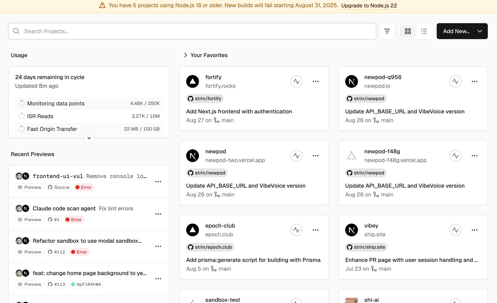

# Scan Targets Page - Product Requirements Document

## Overview

The Scan Targets page provides a centralized interface for users to manage their code security scanning projects, similar to Vercel's project management interface. Users can organize scan targets across different teams and personal spaces, with intuitive project creation and management workflows.

## Interface Layout

### Header Section
- **Search Bar**: Global search functionality with placeholder "Search Projects..." 
- **View Toggle**: Grid/List view options (grid and list icons)
- **Add New Button**: Primary CTA with dropdown for "Add New..." actions
- **User Avatar**: Profile access in top-right corner

### Team/Workspace Selector
- **Team Dropdown**: Toggle between Personal and team workspaces
- **Default**: Personal workspace (no team affiliation)
- **Team Options**: List of teams user has access to
- **Visual Indicator**: Team avatar/icon next to team name

### Recent Activity (Left Sidebar)
- **Recent Scans**: List of recent scan activities with status indicators
- **Status Icons**: 
  - ✅ Success (completed scans)
  - ❌ Error (failed scans) 
  - ⏳ In Progress (running scans)
- **Quick Actions**: Preview, source code, error details

## Main Content Area

### Scan Targets Grid
Display scan targets in card format with the following information:

#### Scan Target Card Layout
- **Repository Icon**: GitHub/GitLab/Bitbucket logo based on source
- **Scan Target Name**: Clear, readable project identifier
- **Repo Path**: `owner/repository-name` format
- **Branch**: `main` format
- **Last Scan Info**: 
  - Timestamp: "Aug 27 on 🌿 main" 
  - Status
  - Vulnerability stats: e.g. 5 high, 10 medium, 15 low
- **Quick Actions Menu**: Three-dot menu with options:
  - View scan results
  - Configure settings  
  - Favorite/unfavorite

#### Card Examples (Based on Interface)
1. **fortify** - `strin/fortify`
   - "Add Next.js frontend with authentication"
   - Aug 27 on 🌿 main
   - 10 vulnerabilities: 5 high, 5 medium
   - Status: completed

1. **newpod-q956** - `newpod.io`  
   - "Update API_BASE_URL and VibeVoice version"
   - Aug 26 on 🌿 main
   - 10 vulnerabilities: 5 high, 5 medium
   - Status: completed

2. **epoch-club** - `epoch.club`
   - "Add prisma:generate script for building with Prisma" 
   - Aug 5 on 🌿 main
   - 10 vulnerabilities: 5 high, 5 medium
   - Status: completed

## Functional Requirements

### Core Features
1. **Project Creation**
   - "Add New..." dropdown with scan target creation option
   - Repository connection wizard (GitHub, GitLab, Bitbucket)
   - Configuration setup for scan parameters

2. **Team Management**
   - Switch between personal and team workspaces
   - Team-based access control and permissions
   - Shared scan targets within team context

3. **Search and Filter**
   - Global search across all scan targets
   - Filter by team, status, last scan date
   - Sort options (recent activity, alphabetical, scan frequency)

4. **Scan Target Management**
   - Configure scan schedules and triggers
   - View scan history and results
   - Archive/delete unused targets
   - Favorite frequently accessed targets

### User Experience Requirements

#### Navigation
- Consistent with Vercel-style interface patterns
- Breadcrumb navigation for deep-linking
- Quick access to recent and favorite projects

#### Responsive Design
- Grid layout adapts to screen size
- Mobile-friendly card interactions
- Touch-friendly controls on mobile devices

#### Performance
- Fast loading with pagination for large project lists
- Progressive loading of scan results
- Optimistic updates for user actions

### Integration Points
- **Repository Providers**: GitHub, GitLab, Bitbucket OAuth integration
- **Scan Engine**: Connection to backend scanning services
- **Notifications**: Real-time updates on scan completion
- **Analytics**: Usage tracking and security metrics

## Success Metrics
- Time to create first scan target
- User engagement with favorites and recent activities
- Scan target creation conversion rate
- User retention and return frequency

## Reference 

Vercel project page:
